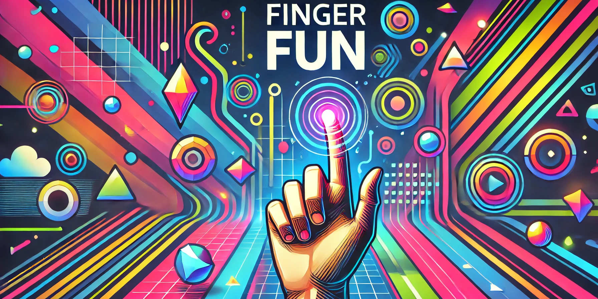

# Finger Fun 🤖👆

**Finger Fun** is an interactive and fun visual game where players must draw patterns using their fingers or objects in front of a camera. Inspired by the classic game "Simon Says", players are challenged to replicate a sequence of visual patterns (lines, circles, triangles) in the correct order. As the game progresses, the difficulty increases, adding more patterns or speeding up the game. If the player makes a mistake, the sequence resets, and they have to start over.

This project was developed as part of a Computer Vision course (**Visión por Ordenador I**) at the **Universidad Pontificia Comillas, ICAI**, for the **Engineering Mathematics** program.

## 📜 Table of Contents
- [📌 Project Overview](#-project-overview)
- [🛠️ Installation](#️-installation)
- [🎮 How to Play](#-how-to-play)
- [📂 Project Structure](#-project-structure)
- [🖥️ Technologies Used](#-technologies-used)
- [🙌 Credits](#-credits)

## 📌 Project Overview

In **Finger Fun**, the player is tasked with replicating a sequence of geometric patterns that are shown by the system. The game operates as follows:

1. **Calibration**: The system calibrates the camera using a checkerboard pattern to ensure the accurate recognition of patterns.
2. **Pattern Recognition**: A sequence of visual patterns is shown on the screen, which the player must draw in the correct order.
3. **Sequence Validation**: If the player draws the patterns correctly, the game moves to the next level, adding more patterns or speeding up. If the player fails, the sequence resets and they must try again.
4. **Tracking**: The system tracks the movement of the player’s finger or object in real-time using computer vision, ensuring that each drawn pattern is recognized and validated accurately.

Additionally, **Finger Fun** uses computer vision techniques to track the player's finger or object movements, ensuring the accuracy of the drawn patterns.

## 🛠️ Installation

To set up and run **Finger Fun**, follow the steps below to install the necessary dependencies and get started with the game.

### Prerequisites
Make sure you have the following installed on your system:
- **Python 3.7** or higher
- **pip** (Python's package installer)
- **Raspberry Pi** (for real-time finger tracking with the camera)

### Steps for Installation

1. Clone the repository:
   ```sh
   git clone https://github.com/iqueipopg/FingerFun.git
   ```
2. Install dependencies:
   ```sh
   pip install -r requirements.txt
   ```
3. Run the game:
   ```sh
   python src/main_ff.py
   ```
   
## 🎮 How to Play

### 🔓 Unlocking the Game
- The player must verify their identity by entering a password.
- Press the `B` key (**Block**) to start the unlocking process.
- Enter the correct recognition pattern to proceed.

### ▶️ Starting the Game
- Once unlocked, press the `A` key to begin the game.
- The game consists of **6 rounds** and the player has **5 lives**.

### 🎨 Gameplay Mechanics
- Each round presents a sequence of geometric shapes.
- The number of shapes in a round corresponds to the current round number (e.g., round 3 has 3 shapes).
- The player must **draw the shapes in the correct order** to advance.
- If the player makes more than **5 mistakes**, the game ends.

### 🕹️ Controls
- The game is played using the **index finger** of the hand.
- The player draws the shape's trajectory in the **OpenCV window**.
- To **erase the trajectory** (like a blackboard), press the `Space` key.
- When satisfied with the drawn shape, press `Enter` to submit and verify it.

### ⏭️ Advancing to the Next Round
- After completing a round, the game **locks the window** and displays the next round’s sequence.

The challenge increases with each round, requiring faster and more precise drawing skills to win!

## 📂 Project Structure

The structure of this project is organized as follows:

- **`assets/`**: Folder containing static files necessary for the game's operation. This includes resources like images or files that may be used by the system during development.

- **`images/`**: Contains images used within the project, with specific subdirectories:
  - **`figures/`**: Images related to the geometric shapes that the player must replicate during the game.
  - **`passwords/`**: Images related to the password verification system.
  - **`plantillas_passwords/`**: Templates of the password patterns used for unlocking the game.

- **`src/`**: Contains the source code of the game. This directory holds Python files and other files related to the game's logic. It includes the following key Python files:
  - **`main_calibration.py`**: This file is responsible for the camera calibration process, ensuring accurate tracking of the player's movements.
  - **`main_ff.py`**: The core file for running the game itself. It handles the game flow, including the pattern recognition and interaction with the player.
  - **`test.py`**: A testing file used to verify the accuracy of the camera calibration and ensure that the system is functioning correctly.
  - **`libreria/`**: Contains additional functions or libraries used in the project. It includes a subdirectory `__pycache__/` for storing compiled Python files.
  - **`__pycache__/`**: Folder that stores the automatically generated `.pyc` files by Python to optimize code execution.

- **`template/`**: Folder containing files and templates used to generate project documents, such as reports or documentation.
  - **`appendix/`**: Appendix files, likely containing additional documentation or technical details.
  - **`figures/`**: Images or diagrams used in the documentation.
  - **`frontmatter/`**: Preliminary information likely used in the configuration of the generated documentation.
  - **`mainmatter/`**: The main body of the project documentation.

This structure is designed to efficiently organize the game’s resources and code, separating images, code, and documentation files to facilitate development and maintenance of the project.

## 🖥️ Technologies Used

This game, **Finger Fun**, leverages a combination of hardware and software technologies to deliver an interactive experience. The system operates using a **Raspberry Pi** connected to a camera, while a computer communicates with the Raspberry Pi to run the game. Here are the key technologies used in the development of the project:

### Hardware
- **Raspberry Pi**: The game runs on a Raspberry Pi, which processes the data from the camera and runs the necessary software to track and interpret the player’s finger movements.
- **Camera**: A camera connected to the Raspberry Pi is used for real-time tracking of the player's finger movements, which are essential for drawing the geometric shapes.

### Software
- **Python**: The code for the game is written in Python, utilizing a number of powerful libraries to handle computer vision, system interactions, and file operations.

### Libraries Used
- **OpenCV (`cv2`)**: A powerful library used for computer vision tasks such as pattern recognition, real-time tracking of the player's finger movements, and drawing the geometric shapes on the screen.
- **Time**: A standard Python library used for managing time-related tasks, such as implementing delays and managing game rounds.
- **OS**: The `os` library is used for interacting with the operating system, including file management (creating, moving, and deleting files or directories).
- **Shutil**: A standard Python library for file operations, such as copying, removing, or moving files and directories.
- **NumPy**: A library for numerical computing, used to handle arrays and perform matrix operations required for pattern recognition and manipulation.
- **MediaPipe**: A cross-platform library developed by Google, used for hand tracking in this game. It helps with accurately tracking the movement of the player's finger to replicate geometric shapes.
- **Custom Library (`libreria`)**: This project uses a custom library called `libreria`, which contains additional functions (`funciones`) and constants used throughout the game to manage specific tasks, such as pattern recognition and game logic.
  
  - **`libreria.funciones`**: A collection of custom functions to help with various game-related tasks, such as handling user input and processing geometric shapes.
  - **`libreria.constants`**: A file containing constants used throughout the game to maintain consistency and avoid hardcoding values in multiple places.

The combination of these hardware and software components creates an interactive and responsive game, where players can use their finger movements to draw geometric patterns and advance through levels.

## 🙌 Credits

This project was developed as part of the **Computer Vision I** course at **Universidad Pontificia Comillas, ICAI**, for the **Engineering Mathematics** program. We would like to extend our sincere thanks to everyone who contributed to the success of this project.

### Special Thanks To:
- **Erik Velasco**: Our professor, for providing the slides, materials, and guidance throughout the course. His teachings were fundamental to the development of this project.
- **Universidad Pontificia Comillas, ICAI**: For providing the educational environment and resources that made this project possible.
- **MediaPipe Documentation**: For providing extensive resources and examples on hand tracking and computer vision techniques that were key to the implementation of the game mechanics.
- **OpenCV Documentation**: For offering comprehensive guides and examples that helped us implement image processing and computer vision tasks essential for the game.
  
### Developers:
- **Beltrán Sánchez Careaga**
- **Ignacio Queipo de Llano Pérez-Gascón**

We would also like to acknowledge all the open-source libraries and resources that made this project possible. Without these contributions, the development of the game would not have been as efficient or smooth.

