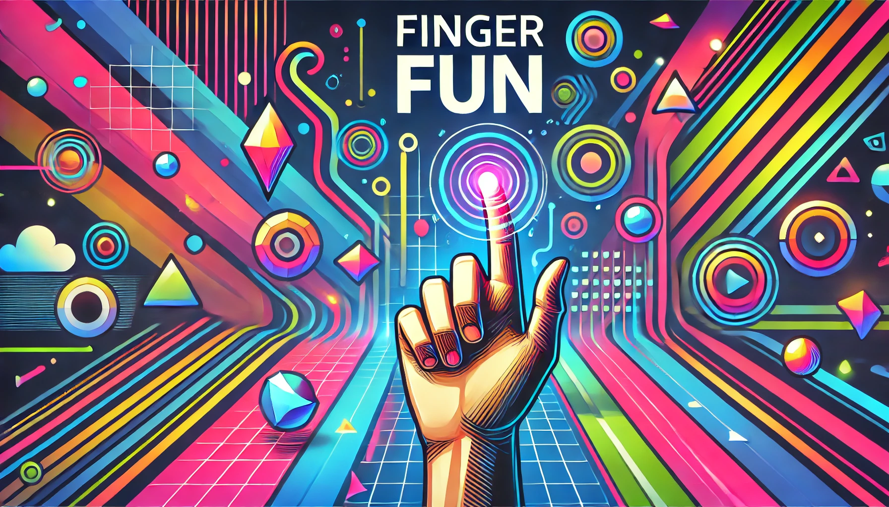

# Finger Fun 🤖👆

**Finger Fun** is an interactive and fun visual game where players must draw patterns using their fingers or objects in front of a camera. Inspired by the classic game "Simon Says", players are challenged to replicate a sequence of visual patterns (lines, circles, triangles) in the correct order. As the game progresses, the difficulty increases, adding more patterns or speeding up the game. If the player makes a mistake, the sequence resets, and they have to start over.

This project was developed as part of a Computer Vision course (Visión por Ordenador I) at the Universidad Pontificia Comillas, ICAI, for the Engineering Mathematics program.

## Table of Contents
- [Project Overview](#project-overview)
- [Installation](#installation)
- [How to Play](#how-to-play)
- [Project Structure](#project-structure)
- [Technologies Used](#technologies-used)
- [Credits](#credits)

## Project Overview

In **Finger Fun**, the player is tasked with replicating a sequence of geometric patterns that are shown by the system. The game operates as follows:
1. **Calibration**: The system calibrates the camera using a checkerboard pattern to ensure the accurate recognition of patterns.
2. **Pattern Recognition**: A sequence of visual patterns is shown on the screen, which the player must draw in the correct order.
3. **Sequence Validation**: If the player draws the patterns correctly, the game moves to the next level, adding more patterns or speeding up. If the player fails, the sequence resets and they must try again.
4. **Tracking**: The system tracks the movement of the player’s finger or object in real-time using computer vision, ensuring that each drawn pattern is recognized and validated accurately.

Additionally, **Finger Fun** uses computer vision techniques to track the player's finger or object movements, ensuring the accuracy of the drawn patterns.

## How to play

1. **Calibration**: The game will first calibrate the camera to ensure accurate recognition of the patterns. You will need to follow the on-screen instructions to complete this step.

2. **Pattern Recognition**: After calibration, the system will display a sequence of geometric patterns (lines, circles, triangles). Your task is to replicate the sequence by drawing these shapes using your finger or any object in front of the camera. Each pattern must be drawn in the exact order it appears.

3. **Tracking**: The system uses real-time tracking to follow the movement of your finger or object as you draw each pattern. The camera detects your movements, and the system tracks the patterns you draw in real-time. This ensures that your input is captured accurately and that you replicate the pattern in the correct position and direction.

4. **Sequence Validation**: If you draw the correct sequence, the game will increase the difficulty by either adding more patterns or speeding up the sequence. If you make a mistake, the sequence resets and you need to start again.

5. **Keep Playing**: The game continues to challenge you with increasingly complex sequences. Can you keep up with the speed and complexity?
